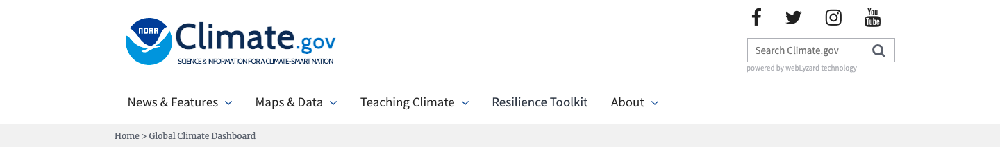
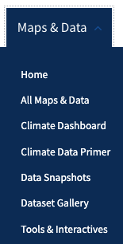
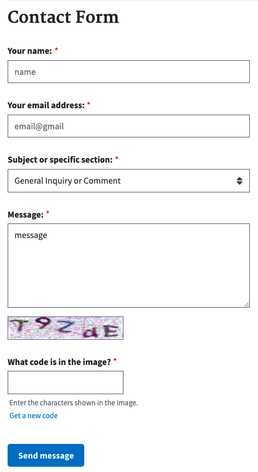
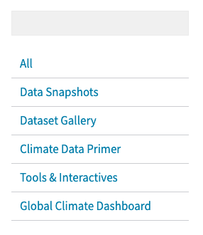
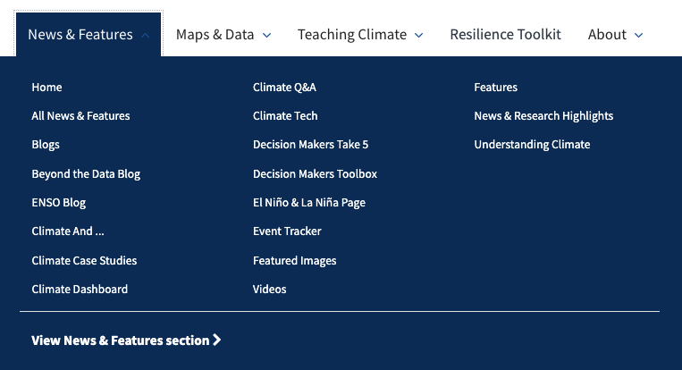

## Assignment 01: Heuristic Evaluation

Cassidy Tu, DH110 Fall '22

### Project Description

### Jakob Nielson's [10 Usability Heuristics](https://www.nngroup.com/articles/ten-usability-heuristics/)

The following principles are general rules of thumb to improve interaction design:
| Number | Heuristic | Description |
|---|---|---|
| 1 | Visibility of System Status | Users should always be informed about what is going on and should be given appropriate feedback to their actions |
| 2 | Match Between System and the Real World | Use concepts and language that are familiar and logical to the user |
| 3 | User Control and Freedom | Allow users to make mistakes; give them options to undo and redo tasks |
| 4 | Consistency and Standards | Follow conventions and make sure design is consistent across the platform |
| 5 | Error Prevention | Get rid of error-prone conditions and provide users with safety nets for high-cost errors |
| 6 | Recognition Rather Than Recall | Minimize user's memory load by giving them suggestions and help in context |
| 7 | Flexibility and Efficiency of Use | Provide multiple ways to perform a task to make the platform accessible to all users |
| 8 | Aesthetic and Minimalist Design | Provide only relevant content and features |
| 9 | Help Users Recognize, Diagnose, and Recover From Errors | Tell users what the problem is and provide suggestions to fix it |
| 10 | Help and Documentation | Supply users with extra help to complete their tasks |

### Nielsen Norman Group's [Severity Ratings](https://www.nngroup.com/articles/how-to-rate-the-severity-of-usability-problems/) for Usability Problems

The following rating scale can be used to evaluate the severity of usability issues:
| Rating | Description |
|---|---|
| 1 | Cosmetic problem only: need not be fixed unless extra time is available on project |
| 2 | Minor usability problem: fixing this should be given low priority |
| 3 | Major usability problem: important to fix, so should be given high priority |

## Website 01: [NOAA Climate.gov](https://www.climate.gov/)

### About
Climate.gov project is a collaboration of multiple NOAA (National Oceanic and Atmospheric Administration) offices, who are responsible for being the nation's environmental intelligence agency. The website serves to provide timely and authoritative scientific data and information about climate science, in turn, promoting public understanding of climate-related events and supplying them with tools and resources to make eco-conscious decisions.

The website is filled with a numerous amount of content to meet the needs of different audiences, which can be both accomodating but overwhelming. Each tab at the navigation bar drops down to a multitude of choices and ultimately acts like its own website, rather than parts of a singular cohesive site. My goal would be to simplify these different branches into a more coordinated website, while still maintaining the wealth of information provided.

### Heuristic Evaluation

#### 1. Visibility of System Status
* While the user's current location is displayed, the presentation could be further emphasized. The current display has the specific tab and subpage written in a small text on a gray bar underneath the navigation bar, which could easily be overlooked by users who focus on the main navigation bar more. There is also a lack of consistency, as some subpages do not list which tab they are under.

  

> Severity Rating: 1 

> *Recommendation: Display the user location directly on the navigation bar. This would more prominent to the user, as the visibility would be higher.*

* There is lack of descriptive tab labels as each tab on the navigation bar has a "Home" subpage that each lead to a different page. This creates an ambiguous status symbol when users' current locations display they are on one of the many "Home" pages.

  
  
  

> Severity Rating: 3

> *Recommendation: Remove the multiple "Home" pages, as there is already an action button that leads to the page at the bottom of the drop down menu or rename the tabs more descriptively. This would also clear any ambiguity with the actual Home page of the website.*

#### 2. Match Between System and the Real World
* g

  

> Severity Rating:

> *Recommendation: *

#### 3. User Control and Freedom
* g

  

> Severity Rating:

> *Recommendation: *

#### 4. Consistency and Standards
* g

  

> Severity Rating:

> *Recommendation: *

#### 5. Error Prevention
* When submitting a message under the Contact form, input fields are not checked for validity (only whether or not they are filled out). This leaves the opportunity of users making mistakes when inputting vital information (ex. email) incorrectly.

  

> Severity Rating: 2

> *Recommendation: Ensure all input fields (especially the Email field) follow a valid format to catch any mistakes users might accidentally make while filling the form out.*

#### 6. Recognition Rather Than Recall
* When viewing all maps and data, there is a search bar block above the subpages of the tab. However, it is difficult for users to recognize the function of the box at first glance.

  

> Severity Rating: 3

> *Recommendation: Add a search icon and some placeholder text to make the search box easily recognizable, rather than having the user remember that the box is meant to be used for searching.*

#### 7. Flexibility and Efficiency of Use
* g

  

> Severity Rating:

> *Recommendation: *

#### 8. Aesthetic and Minimalist Design
* Due to the extensive information and content on the website, the dropdown menu of each tab is cluttered with many options. This is very overwheling to users as they are presented with too many choices.

  

> Severity Rating: 3

> *Recommendation: Eliminate unnecessary options in the drop down menu. Consolidate similar categories together (such as all the Blogs) and perhaps filter directly on the page instead of having each specific choice on the menu.*

#### 9. Flexibility and Efficiency of Use
* g

  

> Severity Rating:

> *Recommendation: *

#### 10. Help and Documentation
* g

  

> Severity Rating:

> *Recommendation: *

## Website 02: [CalEPA](https://calepa.ca.gov/)

### About
CalEPA (California Environmental Protection Agency) is a state-level 

The website is filled with a numerous amount of content to meet the needs of different audiences, which can be both accomodating but overwhelming. Each tab at the navigation bar drops down to a multitude of choices and ultimately acts like its own website, rather than parts of a singular cohesive site. My goal would be to simplify these different branches into a more coordinated website, while still maintaining the wealth of information provided.

### Heuristic Evaluation

#### 1. Visibility of System Status
* While the user's current location is displayed, the presentation could be further emphasized. The current display has the specific tab and subpage written in a small text on a gray bar underneath the navigation bar, which could easily be overlooked by users who focus on the main navigation bar more. There is also a lack of consistency, as some subpages do not list which tab they are under.

  

> Severity Rating: 1 

> *Recommendation: Display the user location directly on the navigation bar. This would more prominent to the user, as the visibility would be higher.*

* There is lack of descriptive tab labels as each tab on the navigation bar has a "Home" subpage that each lead to a different page. This creates an ambiguous status symbol when users' current locations display they are on one of the many "Home" pages.

  
  
  

> Severity Rating: 3

> *Recommendation: Remove the multiple "Home" pages, as there is already an action button that leads to the page at the bottom of the drop down menu or rename the tabs more descriptively. This would also clear any ambiguity with the actual Home page of the website.*

#### 2. Match Between System and the Real World
* g

  

> Severity Rating:

> *Recommendation: *

#### 3. User Control and Freedom
* g

  

> Severity Rating:

> *Recommendation: *

#### 4. Consistency and Standards
* g

  

> Severity Rating:

> *Recommendation: *

#### 5. Error Prevention
* When submitting a message under the Contact form, input fields are not checked for validity (only whether or not they are filled out). This leaves the opportunity of users making mistakes when inputting vital information (ex. email) incorrectly.

  

> Severity Rating: 2

> *Recommendation: Ensure all input fields (especially the Email field) follow a valid format to catch any mistakes users might accidentally make while filling the form out.*

#### 6. Recognition Rather Than Recall
* When viewing all maps and data, there is a search bar block above the subpages of the tab. However, it is difficult for users to recognize the function of the box at first glance.

  

> Severity Rating: 3

> *Recommendation: Add a search icon and some placeholder text to make the search box easily recognizable, rather than having the user remember that the box is meant to be used for searching.*

#### 7. Flexibility and Efficiency of Use
* g

  

> Severity Rating:

> *Recommendation: *

#### 8. Aesthetic and Minimalist Design
* Due to the extensive information and content on the website, the dropdown menu of each tab is cluttered with many options. This is very overwheling to users as they are presented with too many choices.

  

> Severity Rating: 3

> *Recommendation: Eliminate unnecessary options in the drop down menu. Consolidate similar categories together (such as all the Blogs) and perhaps filter directly on the page instead of having each specific choice on the menu.*

#### 9. Flexibility and Efficiency of Use
* g

  

> Severity Rating:

> *Recommendation: *

#### 10. Help and Documentation
* g

  

> Severity Rating:

> *Recommendation: *
