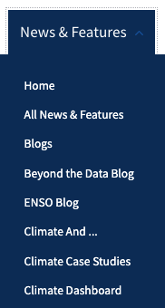
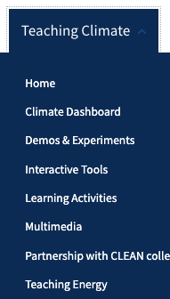
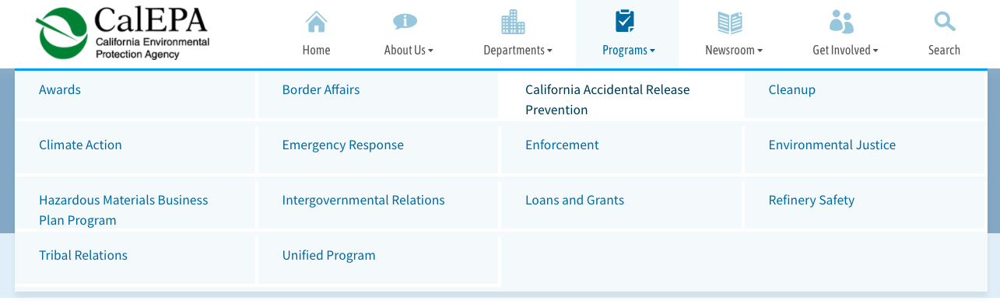

## Assignment 01: Heuristic Evaluation

# Climate Action

Cassidy Tu, DH110 Fall '22

### Project Description
Climate change is a threat to our whole civilization, with effects that are already prominent and will continue to grow to catastrophic heights unless action is taken now. As one of the biggest challenges to tackle in today's society, world leaders have come together and agreed on a plan to make the world a greener, fairer, and better place by 2030. This movement is apart of the 17 Global Goals to achieve this future. Goal 13 is Climate Action, where we need to take urgent action to combat climate change and its impact.

By creating this project, I hope to make the knowledge needed to combat climate change more accessible to the public, for the sake of our the world's future. 

### Jakob Nielson's [10 Usability Heuristics](https://www.nngroup.com/articles/ten-usability-heuristics/)

The following principles are general rules of thumb to improve interaction design:
| Number | Heuristic | Description |
|---|---|---|
| 1 | Visibility of System Status | Users should always be informed about what is going on and should be given appropriate feedback to their actions |
| 2 | Match Between System and the Real World | Use concepts and language that are familiar and logical to the user |
| 3 | User Control and Freedom | Allow users to make mistakes; give them options to undo and redo tasks |
| 4 | Consistency and Standards | Follow conventions and make sure design is consistent across the platform |
| 5 | Error Prevention | Get rid of error-prone conditions and provide users with safety nets for high-cost errors |
| 6 | Recognition Rather Than Recall | Minimize user's memory load by giving them suggestions and help in context |
| 7 | Flexibility and Efficiency of Use | Provide multiple ways to perform a task to make the platform accessible to all users |
| 8 | Aesthetic and Minimalist Design | Provide only relevant content and features |
| 9 | Help Users Recognize, Diagnose, and Recover From Errors | Tell users what the problem is and provide suggestions to fix it |
| 10 | Help and Documentation | Supply users with extra help to complete their tasks |

### Nielsen Norman Group's [Severity Ratings](https://www.nngroup.com/articles/how-to-rate-the-severity-of-usability-problems/) for Usability Problems

The following rating scale can be used to evaluate the severity of usability issues:
| Rating | Description |
|---|---|
| 1 | Cosmetic problem only: need not be fixed unless extra time is available on project |
| 2 | Minor usability problem: fixing this should be given low priority |
| 3 | Major usability problem: important to fix, so should be given high priority |

## Website 01: [NOAA Climate.gov](https://www.climate.gov/)

### About
Climate.gov project is a collaboration of multiple NOAA (National Oceanic and Atmospheric Administration) offices, who are responsible for being the nation's environmental intelligence agency. The website serves to provide timely and authoritative scientific data and information about climate science, in turn, promoting public understanding of climate-related events and supplying them with tools and resources to make eco-conscious decisions.

### Overall Evaulation
The website is filled with a numerous amount of content to meet the needs of different audiences, which can be both accomodating but overwhelming. Each tab at the navigation bar drops down to a multitude of choices and ultimately acts like its own website, rather than parts of a singular cohesive site. My goal would be to simplify these different branches into a more coordinated website, while still maintaining the wealth of information provided.

### Heuristic Evaluation

#### 1. Visibility of System Status
* While the user's current location is displayed, the presentation could be further emphasized. The current display has the specific tab and subpage written in a small text on a gray bar underneath the navigation bar, which could easily be overlooked by users who focus on the main navigation bar more. There is also a lack of consistency, as some subpages do not list which tab they are under.

  

> Severity Rating: 1 

> *Recommendation: Display the user location directly on the navigation bar. This would more prominent to the user, as the visibility would be higher.*

* There is lack of descriptive tab labels as each tab on the navigation bar has a "Home" subpage that each lead to a different page. This creates an ambiguous status symbol when users' current locations display they are on one of the many "Home" pages.

  
  
  

> Severity Rating: 3

> *Recommendation: Remove the multiple "Home" pages, as there is already an action button that leads to the page at the bottom of the drop down menu or rename the tabs more descriptively. This would also clear any ambiguity with the actual Home page of the website.*

#### 2. Match Between System and the Real World
* The NOAA Climate.gov website follows this heuristic fairly well. An example of how it does this is the use of vocabulary to explain concepts in a way for user to understand. The website understand that their targeted audience are users that are looking for information to learn more about climate science and even has a tab ("Teaching Climate") dedicated to teaching these concepts. 

  

* Another example of how NOAA Climate.gov exercises this heuristic is the use of the calendar icon to indicate dates. The icon is easy to recognize as it is very similar to what calendars look like in real life.

  

> Severity Rating: 0

> *Recommendations: None.*

#### 3. User Control and Freedom
* Many of the maps, demos, and videos will redirect users to another window and present an alert pop-up before proceeding to do so. This allows users to consider their choices and have the freedom to decided whether or not they would like to continue. Although this was a great feature to have in terms of usability, it did get repeitive to have it constantly pop up every time.

  

> Severity Rating: 0.5 (mixed?)

> *Recommendation: Have a feature to stop the alert. For example, if users would like to stop seeing the alerts, check the box. This will prevent repeitiveness.*

#### 4. Consistency and Standards
* The website has great practices in Consistency and Standards with its well-established design system and page and button layout. However, there is a small discrepancy in terms of when and where the search bar is placed. A second search bar is only placed under the Maps tab, while the other tabs do not have one. 

  
  
  

> Severity Rating: 1

> *Recommendations: Add search bar to all tabs or remove the single search bar from the Maps tab to make everything consistent.*

#### 5. Error Prevention
* When submitting a message under the Contact form, input fields are not checked for validity (only whether or not they are filled out). This leaves the opportunity of users making mistakes when inputting vital information (ex. email) incorrectly.

  

> Severity Rating: 2

> *Recommendation: Ensure all input fields (especially the Email field) follow a valid format to catch any mistakes users might accidentally make while filling the form out.*

#### 6. Recognition Rather Than Recall
* When viewing all maps and data, there is a search bar block above the subpages of the tab. However, it is difficult for users to recognize the function of the box at first glance.

  

> Severity Rating: 3

> *Recommendation: Add a search icon and some placeholder text to make the search box easily recognizable, rather than having the user remember that the box is meant to be used for searching.*

#### 7. Flexibility and Efficiency of Use
* One of the many map tools on the website provides little to no instruction on how to utilize it, which makes it difficult for newer, less experienced users to interact with it.

  

> Severity Rating: 2

> *Recommendation: Add unobstrucive instructions or tutorials that would be helpful for newer users, but easily dismissed by more experienced users.*

#### 8. Aesthetic and Minimalist Design
* Due to the extensive information and content on the website, the dropdown menu of each tab is cluttered with many options. This is very overwheling to users as they are presented with too many choices.

  

> Severity Rating: 2

> *Recommendation: Eliminate unnecessary options in the drop down menu. Consolidate similar categories together (such as all the Blogs) and perhaps filter directly on the page instead of having each specific choice on the menu.*

#### 9. Help Users Recognize, Diagnose, and Recover From Errors
* While the search bar does have recommended results that pop up underneath, when users enter typo (or any) mistakes, there is message to indicate that they have ran into an error. This allows the user to recognize and try to diagnose the mistake, but more can be done to assisting the user in recovering from the error.

  

> Severity Rating: 1

> *Recommendation: Offer solutions to mistakes made after searching, such as "Did you mean: climate?". This will help the user recover from the error faster as they will have to exert less mental capcity to fix their mistake.*

#### 10. Help and Documentation
* There are too many FAQ sections dispersed in different parts of the website. The main FAQs are listed under the "About" tab, however, there is a category of questions under this page that redirect to another page titled "Global Warming Frequently Asked Questions". Yet, there is another subpage listed under the "News and Feature" tab titled "Climate Q&A".

  
  
  

> Severity Rating: 2

> *Recommendation: Consildate all the FAQs into one section. If there is too much information to present in one section, have a filter or search bar to help users navigate through it. This would be better than to have all the FAQs scattered in different areas of the website.*

## Website 02: [CalEPA](https://calepa.ca.gov/)

### About
CalEPA (California Environmental Protection Agency) is a state cabinet-level agency in California's government. It is headed by the Office of the Secretary and oversees a multitude of environmental departments and boards, with the mission of restoring, protecting, and enhancing the environment through regulations and laws.

### Overall Evaluation
The website serves as a means for Californian citizens to easily obtain information and services involving any environmental policy or department, as well as a point of contact between the public and government officials. However, much of the site looks outdated and disorganized. My goal would be to modernize the website to fit the needs of the targeted users and optimize accessibiity by presenting information in a more attractive and efficient manner.

### Heuristic Evaluation

#### 1. Visibility of System Status
* The CalEPA website has many good practices of visibility. One of them being the status indicator when users are interacting with the navigation bar, where there is a noticeable background color change to signal that users are able to click for a location change.

  

* Another good practice of visibility is the progress bar at the top of the form to report an environmental complaint. The progress bar allows for users to see where they are in terms of filling out the form, what the next steps look like, and how far along they are.

  

> Severity Rating: 0

> *Recommendations: None.*

#### 2. Match Between System and the Real World
* To report an environmental complaint, users must click on the report button that would lead to a form. However, the visual representation of the button lacks discoverability and does not clearly signify that it can be clicked. The placement of the button on pages throughout the website is off to the side and looks more like an decor image rather than a call to action.

  

> Severity Rating: 2

> *Recommendation: Add a subtle shadow to the button to make it look more clickable and more inline with what a real button would look like. Place the button more centered or near the text instead of off to the side will also bring more attention to it.*

#### 3. User Control and Freedom
* Users only have two options when filling out forms on the website, which are "Next" and "Previous". To leave the form, users must repeatedly click on the "Previous" button and ultimately landing on the first page. However, there is no way to exit unless the browser back button or the logo at the very top of the window (which leads to the homepage) is clicked.

  

> Severity Rating: 3

> *Recommendation: Add a cancel button to allow users to freely exit the form without having to go through all the previous steps, which ultimately leads to frustration from the lack of freedom to move around the website.*

#### 4. Consistency and Standards
* Across the CalEPA website, every page has a different format, layout, color scheme, font, etc. This drastic difference can especially be seen in the numerous types of buttons that are scattered around the site. Not only does it not look visually appealing, but it is also confusing as each button does not convey the same message/clickability.

  
  
  

> Severity Rating: 2

> *Recommendation: Standarize all designs across the website with one cohesive theme, which would make everything look better visually as well as eliminate any confusion/hesitation about any features for users.*

#### 5. Error Prevention
* The search bar does not provide any suggested results and has no constraints, which allow for users to type in anything on purpose or by mistake.

  

> Severity Rating: 2

> *Recommendation: Add recommended query results to suggest searches to users to prevent any searches from going awry and provide correct responses to any typing mistakes.*

#### 6. Recognition Rather Than Recall
* If users wish to find more information on California's climate change solutions (or any specific information), they must go through a long process in order to reach it. This section of the site can only be accessed through clicking the "California Climate Dashboard" button, scrolling to the middle of the page, and clicking on the "Climate Plans and Resources" under "Overview". There is no other way to reach this information and users are required to remember how to get there.

  

> Severity Rating: 3

> *Recommendation: Consolidate all similar information together under a tab, so users are able to easily access what they need without having to remember what process they have to go through to get there.

#### 7. Flexibility and Efficiency of Use
* News releases are displayed year by year and users must individually click through each year and manually scroll through all the articles in order to find what they need. This is both time consuming and overwhelming for more experienced users that know what they are looking for.

  

> Severity Rating: 3

> *Recommendation: Add a search or filter feature to allow for more experienced users to get to the article they need more efficiently.*

#### 8. Aesthetic and Minimalist Design
* Wholistically, the website takes a simple and minimalistic approach, sticking to a majority text block format with very few images. The homepage houses most of the images on the website, in turn, doesn't have a cohesive look with the rest of the site. The bottom, however, is especially cluttered with a multitude of images and buttons (that don't look like buttons and don't have much indication what their call to action is).

  

> Severity Rating: 1

> *Recommendation: Remove any unnecessary images/buttons. If they are necessary, format them in a more organized manner with text to provide more information on them and what users should take away. Unify the website's aesthetic and appearance across the board.*

#### 9. Help Users Recognize, Diagnose, and Recover From Errors
* When users type in the search bar, there is no suggested results that pop up underneath. Recommended queries help users express what they need with less mental effort, see helpful results, and avoid any typo mistakes they may make.

  

> Severity Rating: 2

> *Recommendation: Add suggested search results to help users find what they want to search easily. This would help users avoid or notice any mistakes they are making, allowing them to efficienctly find what they need.*

#### 10. Help and Documentation
* The FAQ section has hyperlinks that automatically send the user to the portion of the page that contains the answer to their question. Otherwise, the page is visually monotone with a huge block of text.

  

> Severity Rating: 1

> *Recommendation: Place the answers under a collapsable box that can expand when clicked on by the user, which would allow for the page to look less cluttered and more organized.*
