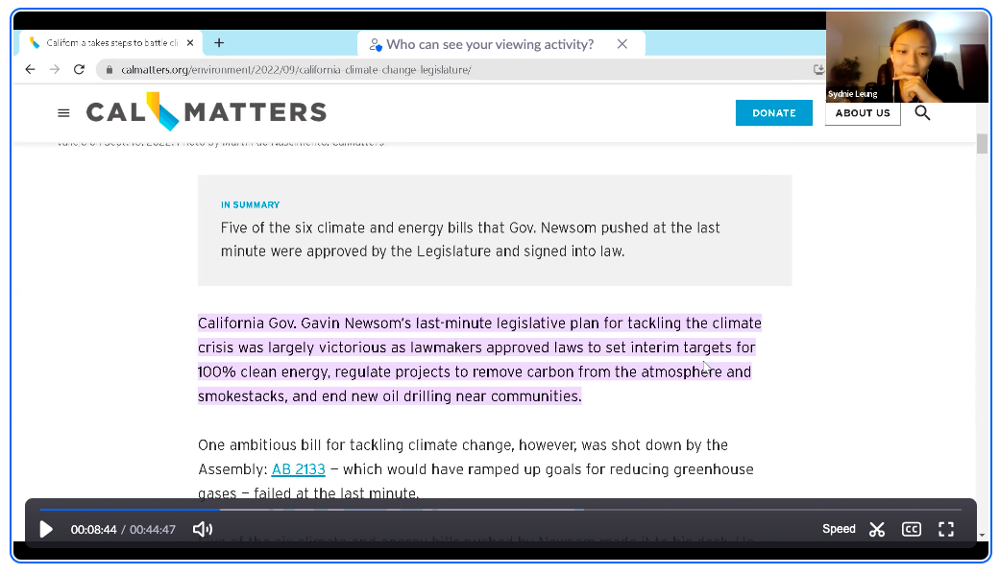
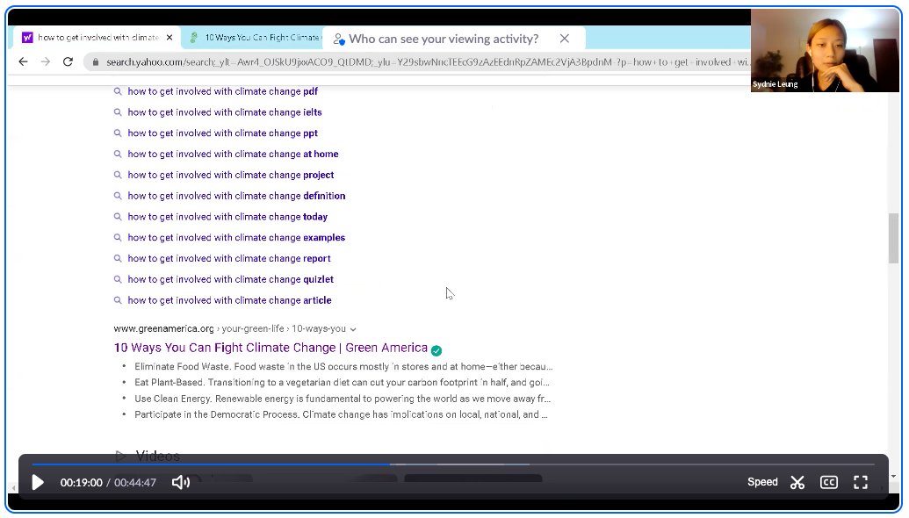

## Assignment 03: Contextual Inquiry

# Climate Action

Cassidy Tu | DH110 Fall '22

## Project Description
#### Step 01: Specify Research Goals & Requirements 
* What is the main activity your project would support for the users?

> The main activity of the project will be to provide users with resources to learn more about climate action in California and ultimately gain the knowledge to participate in change as well. This will hopefully serve as a platform to break down the daunting issue of climate change into more approachable and accessible pieces for the public and inspire thee community to get more involved.

* What is the basic need/goal involved for that activity? 

> According to [Maslow's hierarchy of needs](https://en.wikipedia.org/wiki/Maslow%27s_hierarchy_of_needs), the basic goal involved in this activity is the foundation of physiological need. These biological needs are the critical to human survival, including: air, water, food, and many others. All of these are directly affected by climate change, making this issue significant to all human life.

* What is(are) the traditional/current solution(s) to satisfy the needs?

> The current solutions present viable and sufficent information for users to find, however, the issue lies in how easily accessible and understandable they are to the general public. For example, traditional government websites provide a vast amount of information, but are notorious for being outdated and difficult to navigate. This, in turn, discourages users and creates a disconnect between the typical person and the information they are looking for.

* What is(are) the limitation(s) that possibly would be improved?

> A limitation includes the disorganized structure of websites that lead to users to spend more time finding information or giving up out of frustration. Consolidating the most necessary information in a workflow that is more inline with the thinking process of users would improve on this limitation. Another issue is how the information is presented on these websites. Creating a more interactive and understandable/digestible formate to display information would increase engagement with a larger audience.

#### Step 02: Target Users
* What are the characteristics of users? (ex. demographics, preference, expertise, mainstream vs. extreme) 

> People residing in California, open to all ages (specifically recent grads to middle age for this project) who are capable of browsing the internet for information themselves, of all expertises, mainstream, anyone who would like to learn more about or get involved with climate action

* In which context (where, why, under which conditions) would the users do that activity? 

> Users would complete this activity to find more information on climate action to understand the impacts and intracacies of climate change or to get more involved with the issue. They are able to do this activity anywhere with access to internet.

* What would the users usually do in order to complete that activity? 

> Users would access the online resource through a desktop or mobile device (perferably desktop due to the limited viewspace on mobile devices) to gain more information.

#### Step 03: Research Method

To gain a better sense of how I could create a website that is useful to different types of users, I conducted a virtual contextual inquiry/participatory observation, which was recorded over Zoom.

## Guide
#### Step 04: Plan

Find the interview + observation guide [here](https://docs.google.com/document/d/1LOcuHlhE9_xfVm8iLn6rJiGIBUIHMc6OApZmFnuZzW8/edit?usp=sharing).

#### Step 05: Conduct Research

View the screen recording [here](https://ucla.zoom.us/rec/play/g8R2eN09IvSp4hIG2yuYJ05_VdzgBlsQvYF2wB2t4SuuR47pq4rx9sNcZeCXOpfUwUx1NlbRrfztr7I.GixCSjXmsAxbXXLw).

Listen to the audio file [here](https://ucla.zoom.us/rec/play/ADbVXpfFMJ3rDR8y8wrZki8qSV52FeVS30OuvpVlQdxMgeUJz07Gd8UcQFz4Rhn6rBMjiCTgpt-aCmGL.OWXzgnBnUxsrBbs_).

View the full transcript [here](https://ucla.zoom.us/rec/sdownload/VbGmQXTrrLcGIY7tm2TU3q_kbo5H3UrjOrPfo0nyxVRCfXkaaQuwyEKn9WpLDAtylcwEwo1QQ2uoBDxx.Bku5KZq2FmT5jsYE).

#### Step 06: Organize & Documentation

  

> The user was tasked to explore resources that would help them learn about what California is doing to combat climate change. (Unfortunately, this did not lead them to the CalEPA website.)

 
 

  

> The user was tasked to find some ways that they could get involved with climate change, in general or in their community specfically.

## Reflection
After conducting a pilot usability test, I thought that I was fairly prepared for the contextual inquiry interview. However, the process was a bit different than what I had envisioned. Coming into this project, I was set on the final product I was going to redesigned (the CalEPA website) and solely focused on how I could make it visually better. This contextual inquiry allowed me to revisit the root problem I am trying to address with the product, the accessibility and discoverability of climate action, instead of tunnel-visioning into the visual design of a single website. I had forgotten the users and what they would need, which this activity allowed me to empathize with.

My interviewee provided a different perspective to approaching the issue of getting involved with climate action, as an individual who wasn't really interested. She mentioned ways such as incentives and visually tracking of progress to increase engagement, which was an interesting point that I (or even other designers of other climate action resources) haven't really considered in the sphere of climate action websites. 

It was difficult balance between observing and interjecting, especially during moments when my interviewee had gone silent and wouldn't further elaborate on their thoughts or decisions. I contemplated straying from the script I had created during these moments, which the script in itself was difficult to create. The more open-ended and general questions were quite drastic change from the ones I had drafted for the pilot UT. Overall, the contextual inquiry was a good learning experience for learning more about the users' needs and goals without the product in mind to interfere.
