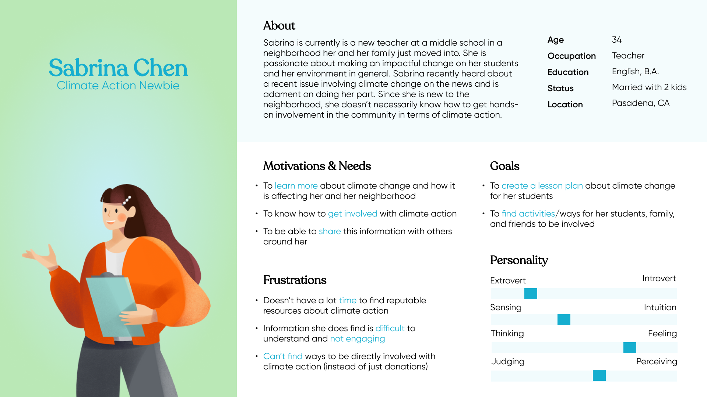
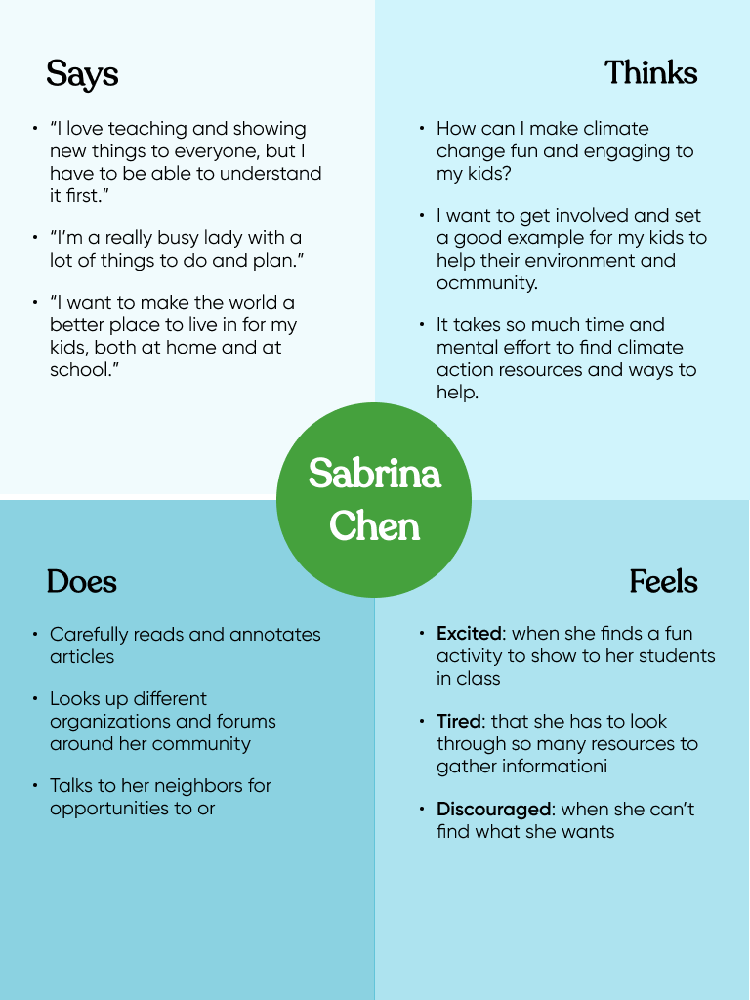
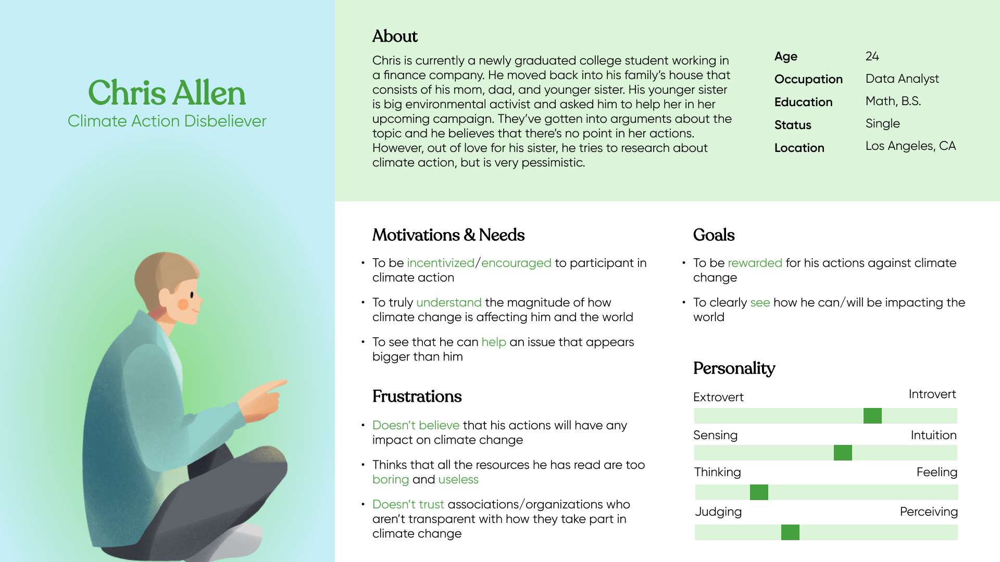
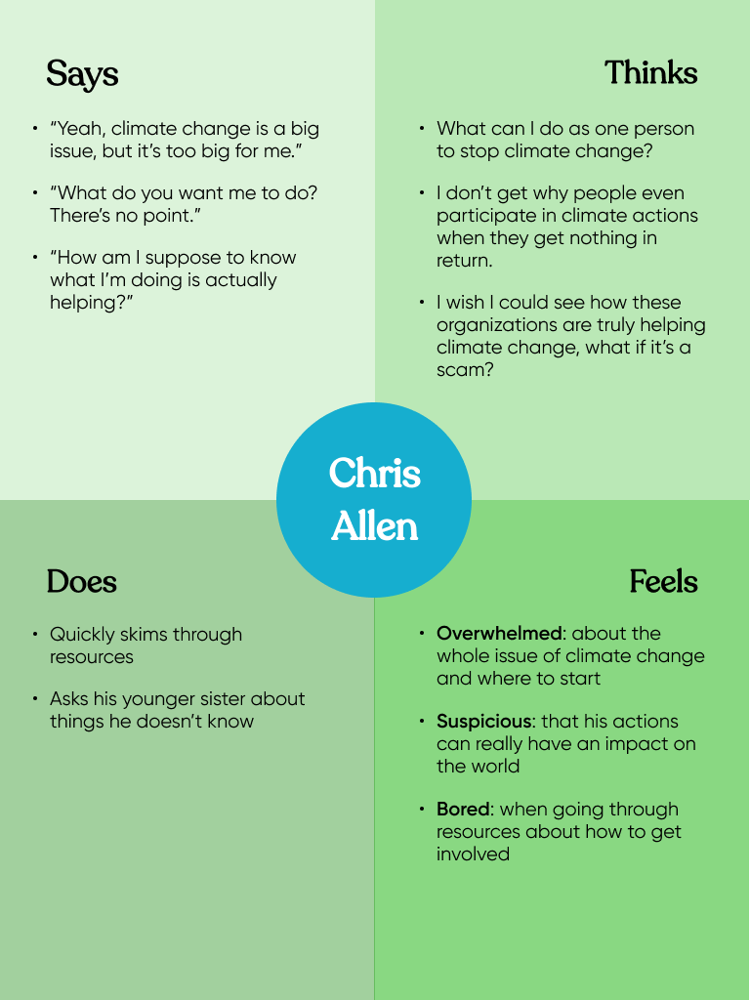
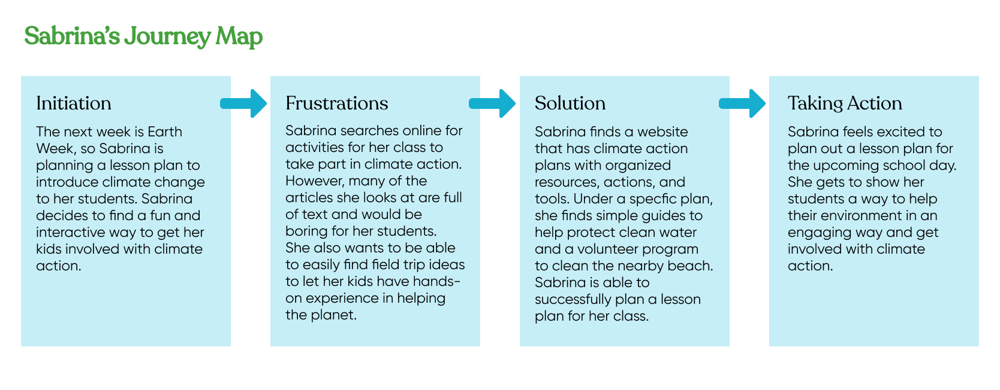
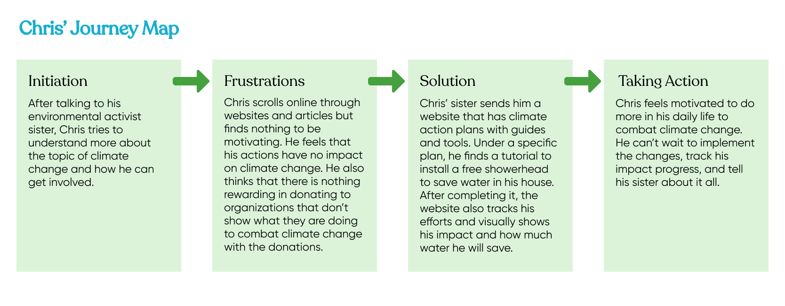

## Assignment 04: UX Storytelling

# Climate Action

Cassidy Tu | DH110 Fall '22

## Purpose
UX storytelling through multiple components (such as personas, empathy maps, scenarios, and journey maps) are used in this project to further understand users by humanizing them. I am able to myself into the perspective of the users by considering all these facets of these personas that are representative of the targeted audience. The purpose is to provide insight about the user and their story, pain points, and behavior, ultimately leading to a better focus on their needs/goals.

## Persona + Empathy Map

### Persona 01: Sabrina Chen

  

### Sabrina's Empathy Map

  

### Persona 02: Chris Allen

  

### Chris's Empathy Map

  

## Scenario + Journey Map

### Scenario 01: Sabrina Chen
#### Why Sabrina is Using the Product
> Sabrina is a mother of 2 and currently is a 4th grade middle school teacher at Ramona Elementary School, where she is preparing to create a lesson path about climate action for Earth Week. She knows that climate change is a complex and overwhelming issue, so she wants to break down the issue into concepts that are easy to understand for her class. All of the resources that she has looked at for information are not that engaging and consist of long blocks of text. She thinks that her students will quickly lose interest in them if she presents them this way. However, for her to teach the class, she must also understand the complexities of climate change and it is very time consuming and tedious to go through multiple different articles. Sabrina also wants to find opportunities for her and her kids, inside and outside the classroom, to get involved with climate action in the community. She thinks that taking a part in combating climate change will set a good example to her students that they can change the world. Thus, Sabrina wants a way to engage and encourage her students to understand climate change and take action against it for a better future.

#### How Sabrina is Using the Product
> After class, Sabrina opens her laptop 

### Sabrina's Journey Map

  

### Scenario 02: Chris Allen
#### Why Chris is Using the Product
> Chris is a newly graduated college student who moved back into his family’s house, with his mom, dad, and younger sister. He hasn’t kept in touch with his sister as much as he wanted but wants to get more involved with her life. She is a huge advocate for climate action and has a big interest in environmental sciences. Chris wants to educate himself about climate change and how he can get involved with climate action, so he can talk to her about it and have a shared interest with his younger sister. However, Chris doesn’t know where to start with the issue and thinks that it is very overwhelming. He skims through articles talking about the impact of climate change on the environment and feels further discouraged. He looks at resources to get involved but doesn’t understand how he can make a difference as a single individual. Not only does he think that his actions are useless to combat climate change, but he also can’t see how some organizations are taking steps to do the same. He is suspicious by the lack of transparency and visual/physical effects of their efforts, ultimately refusing to donate to these organizations and taking action to combat climate change. Thus, Chris wants a way to be incentivized to take climate action and see the results of his actions. 

#### How Chris is Using the Product
> Chris

### Chris's Journey Map

  

