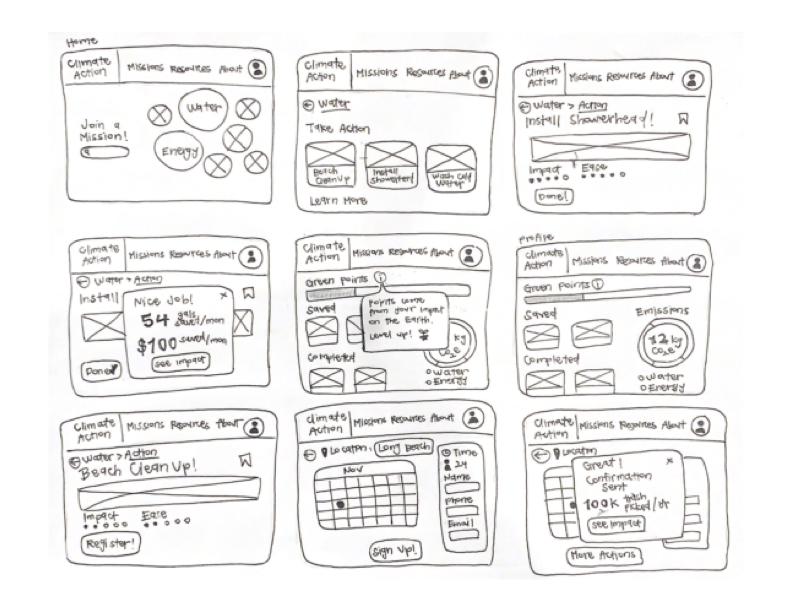
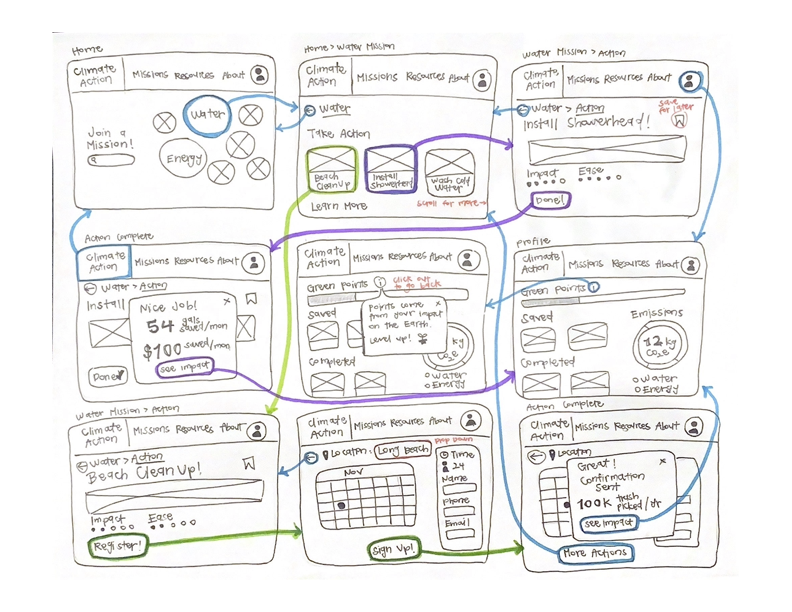
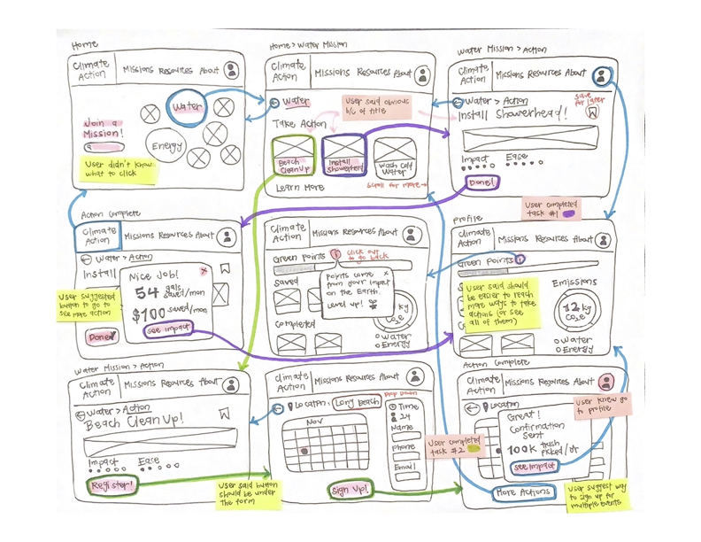

## Assignment 05: Low Fidelity Prototype

# Climate Action

Cassidy Tu | DH110 Fall '22

## Purpose
The purpose of the low fidelity prototyping is to test the flow and functionality of the features that I have conceptualized to educate and encourage targeted users to get involved and learn more about climate action. This process will allow for iterative revisions and identifying the pain points that need to be addressed before moving on to the high fidelity prototypes.

### User Research
Through the analysis and usability testing of current climate action websites (CalEPA), issues of accessibility and overwhelmingness were identified as deterrents for users when interacting with these platforms. This led to a key point of improvement for current websites to make their information more digestible and organized to allow users to easily access them with less frustration.

Based on user research (contextual inquiry and participatory observation), insight about how a typical user interacts with climate action websites and resources was gained. Pain points of lack of engagement, incentives, and motivation to get involved with climate action were prominently brought up. This led to the formation of user personas that reflected the different levels of interest users may have. 

Find more information on the contextual inquiry [here](https://github.com/cassidytu/DH110/blob/main/assignments/03.md).

### Personas & Scenarios
User personas were characterized as adult, public citizens looking into climate action with varying degrees of interest in the subject matter. They are looking for ways to easily incorporate climate action changes into their daily lives and quickly access this information that is presented in an engaging and understandable way. Depending on their interest level, they may need more encouragement and incentives to get involved with climate action.

Find more information on the personas & scenarios [here](https://github.com/cassidytu/DH110/blob/main/assignments/04.md).

### Features
Established by previous user research, the following features were conceptualized to solve common problems faced when learning about climate action:
1. **Action Recommendations Tool** - Suggests possible courses of actions pertaining to a certain mission of climate change; to make involvement easier for users and streamlines the process of finding resources
2. **Tracking Tool** - Tracks logged climate action efforts of user and visualizes their impact in order; to encourage users and minimize their feelings of helplessness

## Wireframes 

  

## Wireflows

  

> Task #01 is drawn in purple. Task #02 is drawn in green. General actions are drawn in blue. Interaction notes of certain features are written in red.

  

> User clicks are highlighted in pink. Successful interactions are denoted in pink. Confusion or suggestions are denoted in green. User was shown picture of plain wireframes without wireflows to see if navigation process was the same as I expected (and it was!).

## Reflection
While first creating the low fidelity prototype, I found myself in an endless cycle of sketching and erasing my paper wireframes. I realized that the task scenarios I had written for my personas weren’t as specific as I thought they would be (at the time of writing them) and there were a lot of things I hadn’t considered. One of these things included feedback for user actions and how that would be integrated with the wireflow. I also used the confirmation as a space to further entice users to stay engaged with words of encouragement and details to verbalize their impact. Although the process was a bit frustrating, low fidelity prototyping was a necessary step that allowed me to visualize the user flow and discover these new aspects that I hadn’t thought about before.  

The experience of testing a low fidelity prototype was new to me, as I had previously conducted different types of user testing with products that were digital and completed or published. It was an awkward experience to ask my user to interact with a paper wireframe and complete tasks with all the screens that essentially show step-by-step what should happen (rather than letting them explore screens of a product blindly). Although, this feeling could also be due to the simple and straightforwardness of my tasks and screens and my user finished the tasks without too much struggle. 

The biggest point of confusion for my user, however, was the home screen and the ambiguity of it. It was unclear what was supposed to be clicked and they had only realized what action should be taken due to looking at the next screens and process of elimination. I would like to revise this through a redesign of the home screen, where more attention will be brought to the missions by making them appear more clickable. 

My user also made multiple suggestions, in terms of wireflow, about being able to easily and quickly navigate back to ways to take action and sign up for events. While prototyping, I had thought that I had included an adequate amount of user flows of going back and canceling, but I didn’t realize that users may also want to reach these sections from certain pages like the profile. I believe that this can be solved by giving the users different ways to navigate through the website through additional links or buttons, which will provide users more freedom and flexibility to reach what they want.
