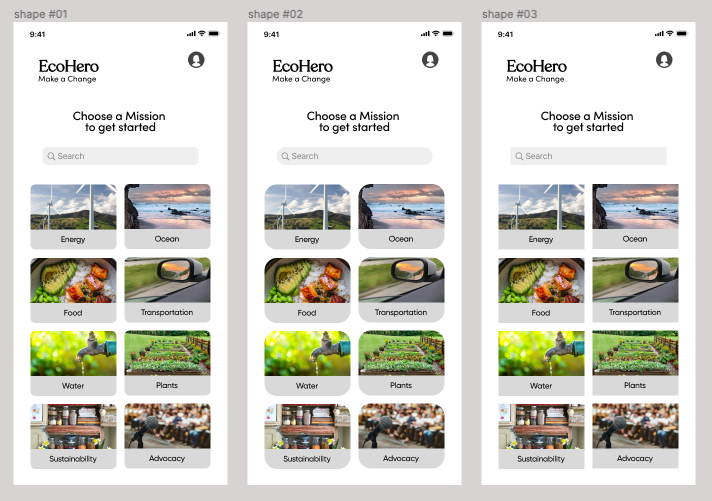

## Assignment 05: Low Fidelity Prototype

# Climate Action

Cassidy Tu | DH110 Fall '22

## Description
My project is to create a platform that will encourage and entice people of the general public to learn more and get involved with climate action. This is done by providing users with ways to be more eco-friendly in an accessible and easy manner, listed under different missions that spearhead different causes ranging from water conservation to sustainability. By presenting these actions, users can incorporate changes into their daily lives that would impact climate change, as well as track the changes they have made. Tracking the progression of each action for users would hopefully further incentivize and encourage them to continue down the path of climate action, as they are able to visualize their impact on the environment.

### Purpose
The purpose of this interface design process is to bring the previous paper, low fidelity prototype to life! Having good interface design is vital, as this will guide a user’s experience with the platform, which will leave users not frustrated or overwhelmed with the content on the screen. The process began with transferring all the elements into a digitized form on Figma, which was tricky as it required some redesigning since my paper prototype was desktop screen size when I needed to create a mobile screen prototype. I started off with using the wireframe for the main missions page and a specific actions page. I tested different typography, shape, and color variations and ran color contrast tests to ensure everything was visually accessible. Impression tests were also conducted to help with looking at the overall image of the design.

## Screen Design
### Layout
The overall grid layout uses 12 columns with a 16px margin and 8px gutter, which was chosen based on this [Medium UX Design article](https://uxdesign.cc/digging-deep-in-layout-grids-in-mobile-app-design-ef07ace5b291) that identified 12 columns as the most optimal number as it allows for both odd and even number of elements in a row. The grid also has 12 rows with a 8px gutter and 32px margin (larger margin to compensate for the top and bottom features of a mobile device). However, I used a 6 row with 16px gutter and 32 margin to align the card elements at the center.

  

### Typography
I used the specific actions page for this testing because it had more text to really show the different variations in typography. In terms of typography, I wanted a friendly and trustworthy look. For the body text, I selected various simple sans-serif fonts that were easy to read including Montserrat, Sofia Pro, and Gilroy. They were all good choices but I thought that Sofia Pro was the most modern and better weight. The heading font was more difficult to select as it would have more of an impact on the overall look, as I wanted it to have more personality. First, I tested Quiche Text and liked how it looked with the name. However, the curves of some letters conflicted with the straightness of others and looked a bit disorganized. Secondly, I tested Quicksand as it had a more cohesive look, but it seemed a bit plain. This made me realize that I wanted to stray away from sans-serif fonts and I found Recoleta, which was a perfect mix of friendly and cohesive.

  

### Shape
I tested three different corner radiuses for the cards (which will also be applied to buttons and other clickable features): 0px (not rounded), 10px (slightly rounded), and 25px (very rounded). I thought that the 0px corner radius seemed too stationary and picture-like, which didn’t convey as much clickability. It also had a more serious, formal look which is opposite to the goal of being more friendly and engaging. On the other hand, the 25px corner radius was too rounded and looked awkward in terms of the spacing around and in between the cards. The 10px corner radius was the best middleground of the two.

  

### Color
I first picked my primary color, which is a bold bluish-purple because it is attention drawing and I knew that I wanted to complement it with a green for a funky take on the typical blue and green color combination used for eco or Earth related things. I used this [Color System page](https://m2.material.io/design/color/the-color-system.html#tools-for-picking-colors\) from Material Design to help generate a palette. However, I tested the combination and thought that the colors were too clashing. (I did really like how it provided lighter and darker variations for accessibility which was helpful.) I used [Coolors](https://coolors.co/2c18a5-b3c2f2-37000a-941c2f-c7d9b7), a color palette generator, for further inspiration and found another color combination that aligned with what I wanted.

This was based on my personal preference, so I decided to conduct a [Preference Test](https://usabilityhub.com/guides/preference-testing) to see what potential users would prefer.

> "I like the colors of the second one more." "The title should be bigger to stand out."
> "The first green is too neon." "I prefer it because it's contrasting but not too much."

  

After finalizing the color scheme, I moved onto creating a dark mode version (which was more difficult than I had expected). Designing a dark mode version is more than switching the white and black colors, so I tried to use different colors from the Material Design palettes provided after selecting a primary and secondary color. I also tried to layer different opacities of the colors to create a mix that would have enough contrast to pass the accessibility test.

  

## Impression Test

## Accessibility Test
Accessibility color contrast was tested with a Figma plugin, Stark, and results are shown below:

  

  

  

  

## Design System

