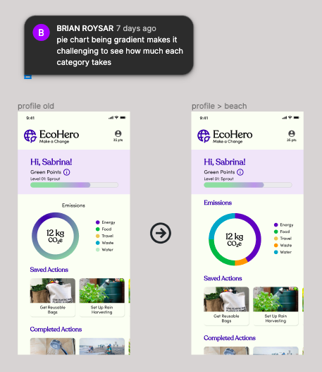
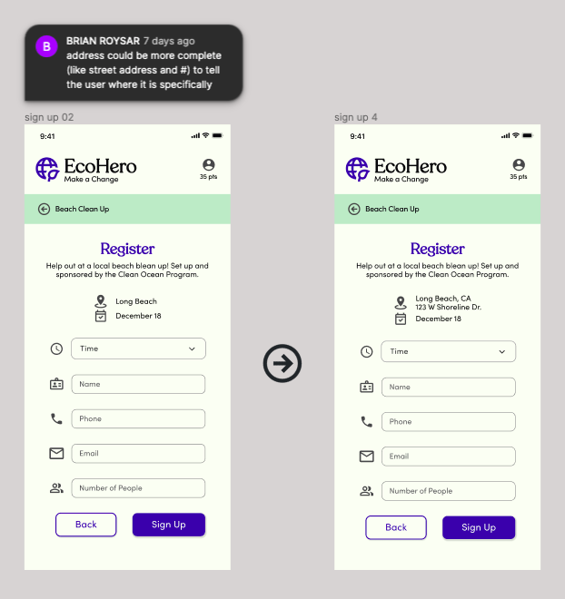
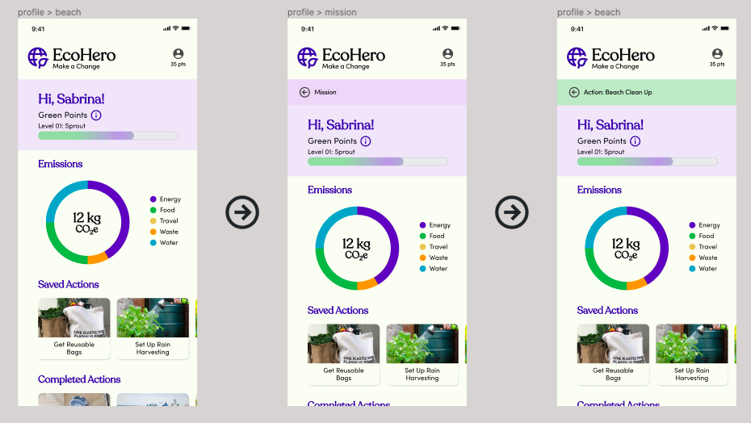
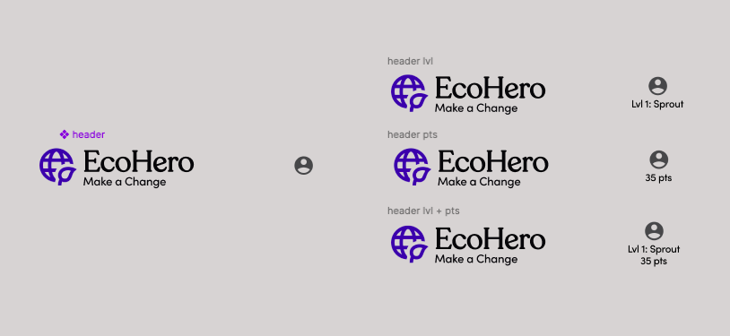
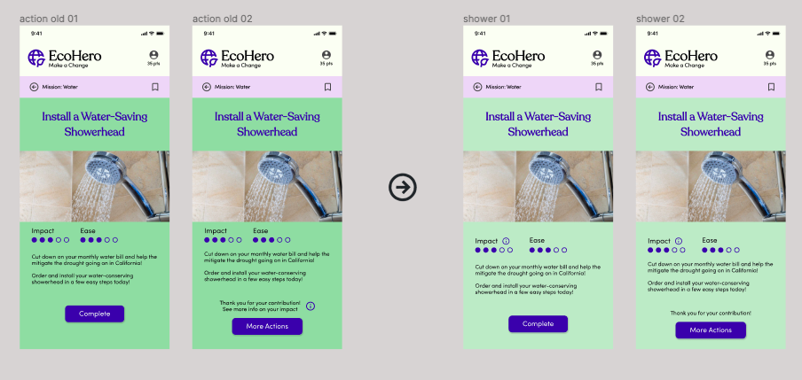

## Assignment 07: High Fidelity Prototype

# Climate Action

Cassidy Tu | DH110 Fall '22

## Description
### Purpose
The project is a mobile website that will encourage and entice people of the general public to learn more and get involved with climate action. The purpose of the high-fidelity prototype is to visualize the foundation set from the previous low-fidelity prototype and wireframes to a higher degree with a more complete look and design system. The high-fidelity prototype also helps validfies the interactions and process flows of the product as users are able to fully test it out by interacting with it, which leads to more specfic feedback to what should be addressed.

### Process
Based off of the previous assignments, I used my design system and the low-fidelity prototype as the foundation to what I would digitally design. After designing the screens, I connected them to see the flow between them and looked at would be missing in the process. I would then switch to the preview and go through the prototype myself and then repeat until I was satisfied. Finally, I did a cognitive walkthrough with users to get more feedback, which will be the basis of my next iterations (along with future usability testing).

## Prototype

  

> The digital wireflow of the prototype.

Find the prototype design file [here](https://www.figma.com/file/fb7HeYASgMqib0UkTgDNFs/dh-110?node-id=213%3A1746&t=vYVwrQR2OXWcNYpd-0).

Find the interactive prototype [here](https://www.figma.com/proto/fb7HeYASgMqib0UkTgDNFs/dh-110?node-id=213%3A1746&scaling=contain&page-id=44%3A8&starting-point-node-id=213%3A1746).

### Tasks
#### Task 01

  

> Completing an action under a specifc environmental mission by signing up for a community event. Signing up for a beach clean up (action) under the Ocean Mission.

#### Task 02

  

> Completing an action and tracking the impact of it in the profile, as well as learning about how it has affected the user and the world. Installing a water-saving showerhead (action) under the Water Conservation Mission.

## Iteration Round #01
I conducted the cognitive walkthrough by presenting my prototype to my roommates on my laptop. I asked them a few questions as they completed the two tasks. The entire process went relatively smoothly as I have had much experience with testing through previous assignments.

**Questions Asked:**
* What do you think that the product is about?
* What do you think you can do with this product?
* Is there any point you didn't know where to click or select?
* Is there any point you felt lost or unsure what to do?
* Is there any point you unclear how to go back or exit?
* Is there anything missing or confusing?

### Feedback

Find the responses to the cognitive walkthrough [here](https://docs.google.com/spreadsheets/d/1GytFM2XniAej5LXCZgfkUcgJoBTHtHErusAZV6Mytxc/edit?usp=sharing).

While I still have much work and iterations to go through, I made a major change to one part of the first taskflow that I had overlooked. A few users pointed out that when signing up for the beach clean up, there was no way to go back to the first calendar screen of signing up. I didn't realize that there was no back button as I had designed and prototyped one back button already, but it would redirect back to the beach clean up page instead of the previous screen.

### Changes

  

>* Cognitive Walkthrough #01: User 2 "not able to click back to calendar"
>* Cognitive Walkthrough #01: User 3 "can't go back to change the date when signing up for the clean up"

I made a few different versions to see what would best be discoverable for the back button as I thought it would be confusing to users if there were two back buttons near each other. My best solution was to place the back action at the bottom near the sign up button. I then used a preference test to decide which version users preferred and most users liked the first version with the back button instead of the arrow next to the sign up button (ver. 2) because it was more clearer. The first version was preferred over the back arrow near the center (ver. 3) because users thought that the arrow was difficult to find admist all the text.

## Iteration Round #02
In class the following day, we got into groups to conduct more cognitive walkthroughs with our prototypes. Using all of the feedback I had gotten, I proceeded to make even more changes during this round of iterations.

Find the responses to the peer cognitive walkthrough [here](https://docs.google.com/document/d/1FXwarKWXMCelA5ImH5dxA7X7Dr3UAEkl2gMW6dviGAY/edit).

### Changes

  

>* Cognitive Walkthrough #01: User 2 "the emissions graph on the profile page is a little hard to interpret"
>* Cognitive Walkthough #01: User 3 "confused about the emissions graph; wish there was a popup to explain it" 
>* Cognitive Walkthrough #02: Brian R. "pie chart being gradient makes it challenging to see how much each category takes"

This is an instance of where the designer (me) has prioritized aesthetics over functionality. I was caught up with having the emissions chart visually match the progress bar, with the gradients, but I came to realization that having solid, clear colors to symbolize the different sections of the chart is more important and easier to read. Other changes I might include in the future is a hover feature that will show how much each section is percentagewise to provide users a more accurate measurement, as colors may still be vague and hard to precisely interpret.

  

> Cognitive Walkthrough #02: Brian R. "address could be more complete (like street address and #) to tell the  user where it is specifically"

I realized that users often prioritize clarity and specficity, which providing more details about the location and its whereabouts would allow users plan and to be more prepared for the event.

## Iteration Round #03
With a more polished high-fidelity prototype, I felt ready to move onto usability testing with a product that has a clear purpose and understand flows between interactions and features. I conducted usability test (UT) to gather live feedback from users by observing them while they interact with the product. This method is to test for the ease of use of the prototype and is great to get direct commentary from the participant about their expectations, thoughts, and behaviors from coming face-to-face with an interactive prototype.

### Materials
Find the recording to UT #01 [here](https://ucla.zoom.us/rec/play/5O8Uxu6wJB0sB_5Oy1pRbC1l9U8HTDyslPh_mTtrHzm_lvTUdeh-62CVjpyDRl20nJ_d7iKZS4X3ZpAd.YQiPXrbraueMcdc_).

Find the recording to UT #02 [here](https://ucla.zoom.us/rec/play/Wxp3LqwZsoDSmJ-ECis9I6-64rW7QZP2tvUoF-f6PtSsLqM7lh_8BS8ADQJ7yckbHopVipTr7NivgUTI.fWGQGKNK1GUT1hb_).

Find the usability test form/script [here](https://forms.gle/1RDkKNS37F8hU2rQ7).

Find the notes to the usability test [here](https://docs.google.com/spreadsheets/d/1YNfRxj5cn4G32DuYWgEZANZhU3U8hJq5gQAgA8Oh5aw/edit?resourcekey=undefined#gid=762250700).

### Changes

  

> UT: User #01; Trouble navigating back to main page

The user had navigated to the profile page during task #01 and when asked to proceed with task #02, was unsure on how to go back to main page. This made me realize that I didn't make an obvious, visible indication on how to navigate out of the profile page. My initial solution was to have a back button that would navigate to the main page, as this would be easy to prototype and a simple fix.

> UT: User #02; Frustrated about back navigation

The user understood how to navigate back to the main page from the profile (clicking on logo and back button), but thought it was annoying to have to go through the entire process to get back to previous action page. I asked what the user would prefer: having a back button to the main page, a back button to the previous page, or a toggle to open/close the profile page. The user said that a toggle wouldn't be ideal as there is so much information going on the profile that it should be its own page and toggles are for mode changes. They preferred the second option as it was must intuitive, which lead to me creating different copies of the profile screen that redirect back to different previous pages.

  

> UT: User #02; Inefficient to go to profile page

Unlike UT User #01, the user didn't proceed to the profile page after seeing the completion pop-up that has a button labelled "See Your Points". They said that they didn't see the need to go out of their way to see their points if they had already knew they had gotten their points. They wanted a quick look at their points and my solution was to display the user's points under their profile icon. However, I had a few options: one version with the points alone, one with the level status alone, and one with both. I eliminated the version with both as it was overcrowded, too much text, and more effort to read all of it, defeating the purpose of quick efficiency. Ultimately, I decided to go with the points over the level status, as users would be forced to remember how many points equal to a certain level rather than recognize how much points they have collected.

  

> UT: User #01; Hovered over impact rating expecting something

During task #02, when asked to find the impact of an action, I noticed the user had hovered over the impact rating as their first course of action. They, ultimately, did find the impact information pop-up but where I had originally put the information was not as intuitive for users as placing it near the impact rating. I realized that I needed to change the placement of this and asked the user why they had hovered in that area first. They responded by saying that they expected it to be there as they are closely related and that it would be nice to be able to see the impact of the action before completing it, as this would greatly motivate them to actually do it.

> UT: User #02; Preferred the placement near ratings

I realized that I had only changed the impact information pop-up in one of the tasks. Upon this realization, I turned the situation into a mini preference test and asked the user which layout of the impact information they had prefer. The user further solidified the choice to move the information near the ratings, stating their preference for it, as it gives more insight into their question of how the impact rating is calculated and satisfied some of their curiosity. They also mentioned how it is nice to be able to see the information prior to completion of the action as well.
