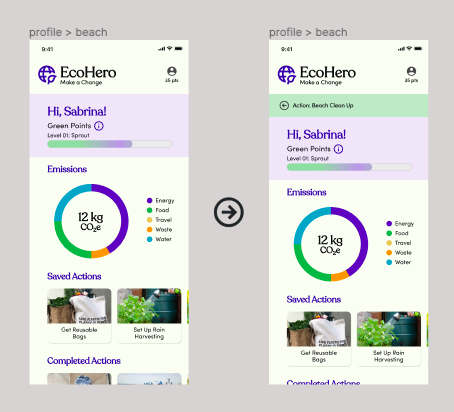

## Assignment 07: High Fidelity Prototype

# Climate Action

Cassidy Tu | DH110 Fall '22

## Description
### Purpose
The project is a mobile website that will encourage and entice people of the general public to learn more and get involved with climate action. The purpose of the high-fidelity prototype is to visualize the foundation set from the previous low-fidelity prototype and wireframes to a higher degree with a more complete look and design system. The high-fidelity prototype also helps validfies the interactions and process flows of the product as users are able to fully test it out by interacting with it, which leads to more specfic feedback to what should be addressed.

### Process
Based off of the previous assignments, I used my design system and the low-fidelity prototype as the foundation to what I would digitally design. After designing the screens, I connected them to see the flow between them and looked at would be missing in the process. I would then switch to the preview and go through the prototype myself and then repeat until I was satisfied. Finally, I did a cognitive walkthrough myself to see the flow and then with a user to get more feedback, which will be the basis of my next iterations (along with future usability testing).

## Prototype

  

> The digital wireflow of the prototype.

Find the prototype design file [here](https://www.figma.com/file/fb7HeYASgMqib0UkTgDNFs/dh-110?node-id=213%3A1746&t=vYVwrQR2OXWcNYpd-0).

Find the interactive prototype [here](https://www.figma.com/proto/fb7HeYASgMqib0UkTgDNFs/dh-110?node-id=213%3A1746&scaling=contain&page-id=44%3A8&starting-point-node-id=213%3A1746).

### Tasks
#### Task 01

  

> Completing an action under a specifc environmental mission by signing up for a community event. Signing up for a beach clean up (action) under the Ocean Mission.

#### Task 02

  

> Completing an action and tracking the impact of it in the profile, as well as learning about how it has affected the user and the world. Installing a water-saving showerhead (action) under the Water Conservation Mission.

## Iteration Round #01
I conducted the cognitive walkthrough by presenting my prototype to my roommates on my laptop. I asked them a few questions as they completed the two tasks. The entire process went relatively smoothly as I have had much experience with testing through previous assignments.

**Questions Asked:**
* What do you think that the product is about?
* What do you think you can do with this product?
* Is there any point you didn't know where to click or select?
* Is there any point you felt lost or unsure what to do?
* Is there any point you unclear how to go back or exit?
* Is there anything missing or confusing?

### Feedback

Find the responses to the Cognitive Walkthrough [here](https://docs.google.com/spreadsheets/d/1GytFM2XniAej5LXCZgfkUcgJoBTHtHErusAZV6Mytxc/edit?usp=sharing).

While I still have much work and iterations to go through, I made a major change to one part of the first taskflow that I had overlooked. A few users pointed out that when signing up for the beach clean up, there was no way to go back to the first calendar screen of signing up. I didn't realize that there was no back button as I had designed and prototyped one back button already, but it would redirect back to the beach clean up page instead of the previous screen.

### Changes

  

I made a few different versions to see what would best be discoverable for the back button as I thought it would be confusing to users if there were two back buttons near each other. My best solution was to place the back action at the bottom near the sign up button. I then used a preference test to decide which version users preferred and most users liked the first version with the back button instead of the arrow next to the sign up button (ver. 2) because it was more clearer. The first version was preferred over the back arrow near the center (ver. 3) because users thought that the arrow was difficult to find admist all the text.

## Iteration Round #02
In class the following day, we got into groups to conduct more cognitive walkthroughs with our prototypes. Using all of the feedback I had gotten, I proceeded to make even more changes during this round of iterations.

Find the responses to the peer cognitive walkthrough [here](https://docs.google.com/document/d/1FXwarKWXMCelA5ImH5dxA7X7Dr3UAEkl2gMW6dviGAY/edit).

### Changes

  

> Cognitive Walkthrough #01: User 2 "the emissions graph on the profile page is a little hard to interpret"
> Cognitive Walkthough #01: User 3 "confused about the emissions graph; wish there was a popup to explain it" 
> Cognitive Walkthrough #02: Brian R. "pie chart being gradient makes it challenging to see how much each category takes"

This is an instance of where the designer (me) has prioritized aesthetics over functionality. I was caught up with having the emissions chart visually match the progress bar, with the gradients, but I came to realization that having solid, clear colors to symbolize the different sections of the chart is more important and easier to read. Other changes I might include in the future is a hover feature that will show how much each section is percentagewise to provide users a more accurate measurement, as colors may still be vague and hard to precisely interpret.

  

> Cognitive Walkthrough #02: Brian R. "address could be more complete (like street address and #) to tell the  user where it is specifically"

I realized that users often prioritize clarity and specficity

## Iteration Round #03

### Materials
Find the recording to UT #01 [here](https://ucla.zoom.us/rec/play/5O8Uxu6wJB0sB_5Oy1pRbC1l9U8HTDyslPh_mTtrHzm_lvTUdeh-62CVjpyDRl20nJ_d7iKZS4X3ZpAd.YQiPXrbraueMcdc_).
Find the recording to UT #02 [here](https://ucla.zoom.us/rec/play/Wxp3LqwZsoDSmJ-ECis9I6-64rW7QZP2tvUoF-f6PtSsLqM7lh_8BS8ADQJ7yckbHopVipTr7NivgUTI.fWGQGKNK1GUT1hb_).

Find the usability test form/script [here](https://forms.gle/1RDkKNS37F8hU2rQ7).
Find the notes to the usability test [here](https://docs.google.com/spreadsheets/d/1YNfRxj5cn4G32DuYWgEZANZhU3U8hJq5gQAgA8Oh5aw/edit?resourcekey=undefined#gid=762250700).

### Changes

  

  

  

